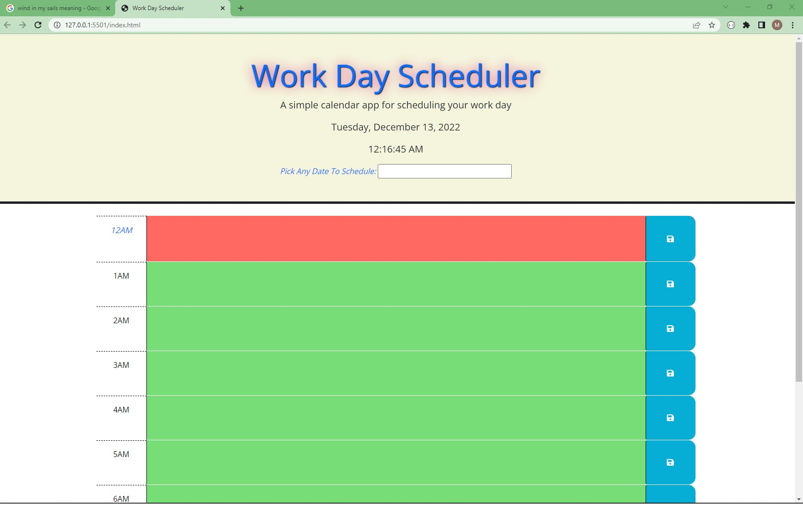
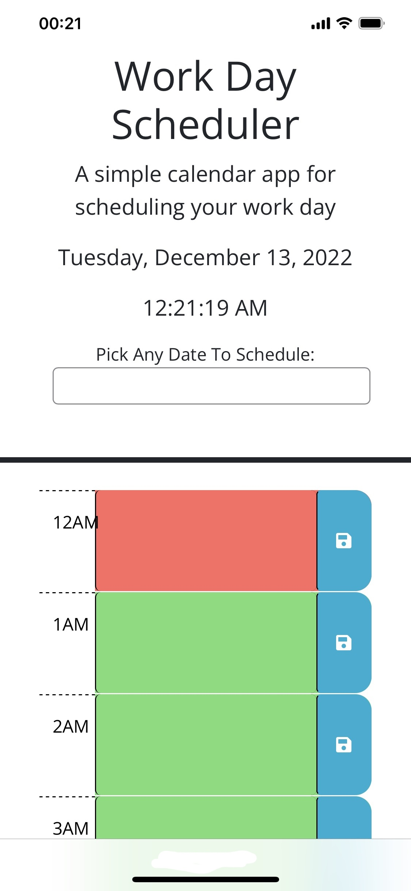
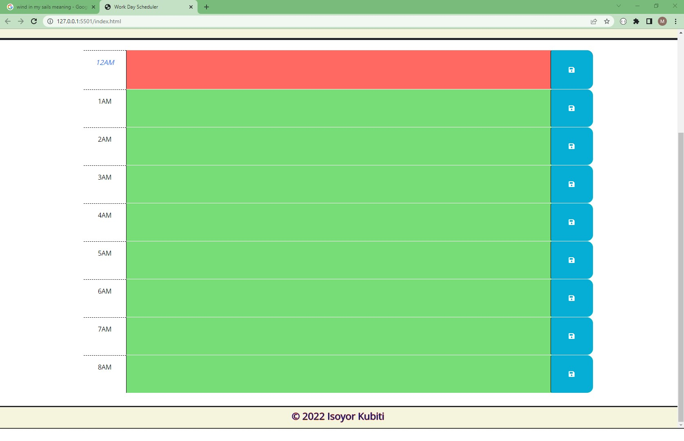
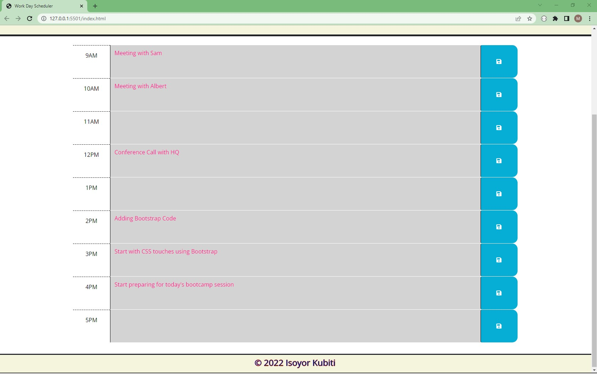
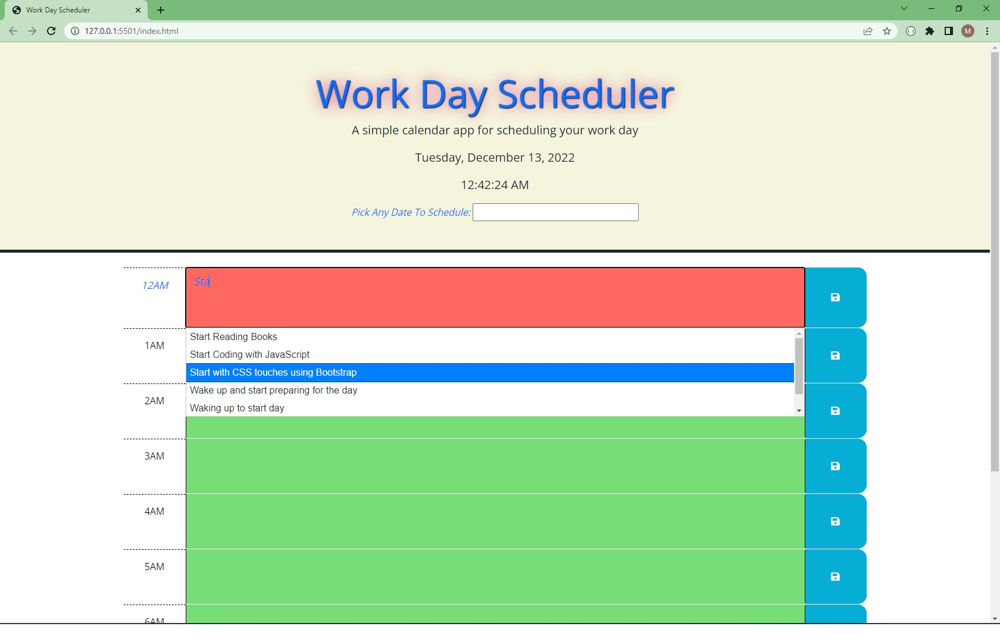
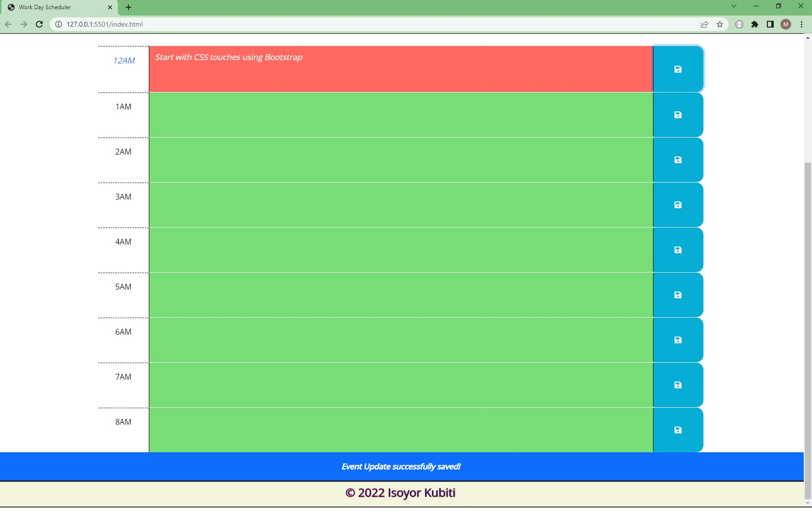
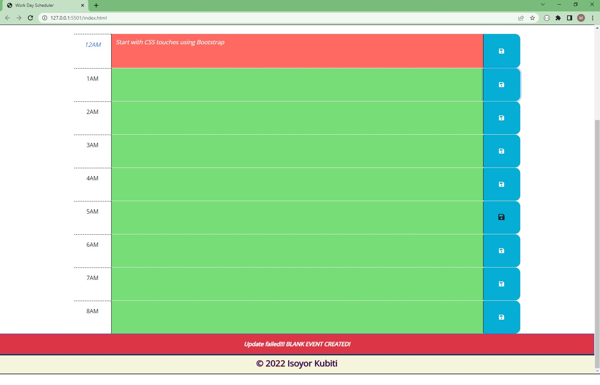
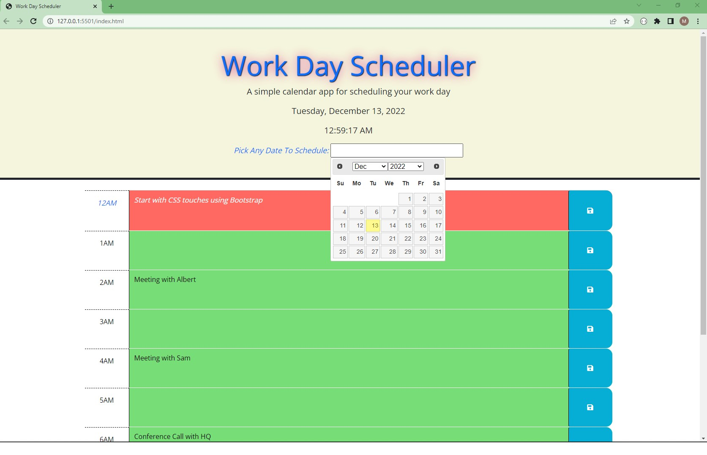
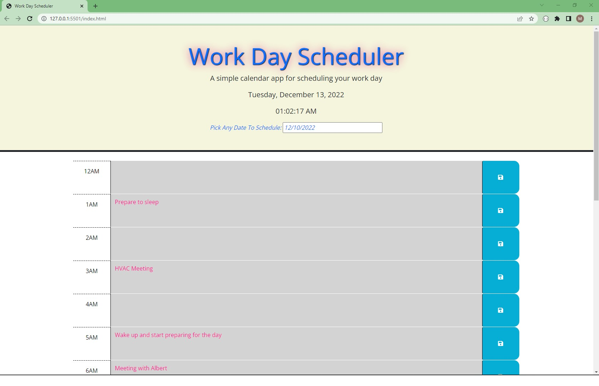
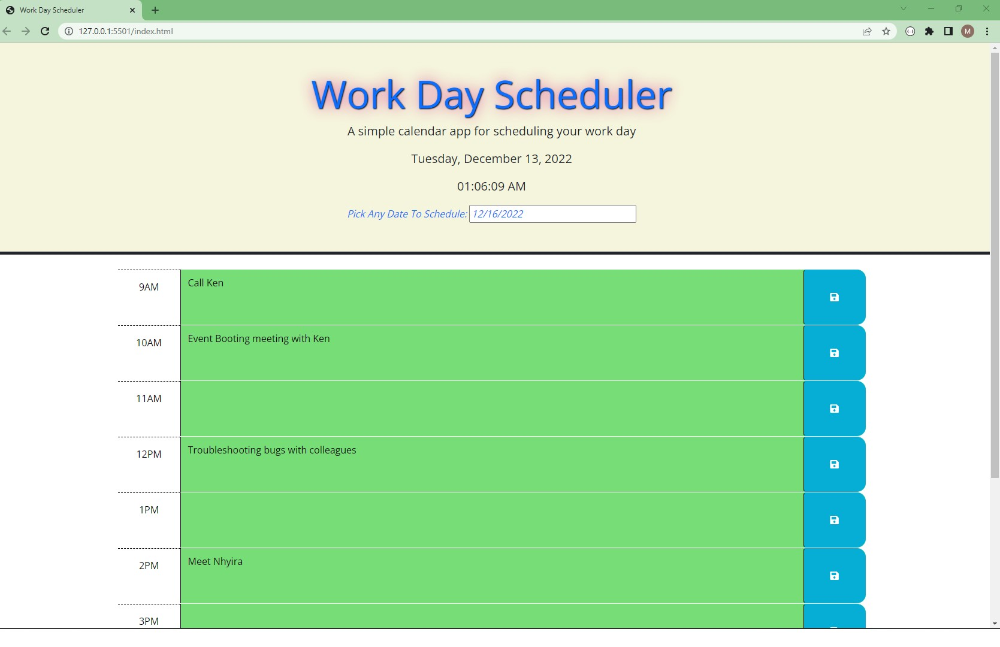

# work-day-scheduler
A simple calendar application that allows a user to save events for each hour of the day.

## Description

This project creates a simple calendar application that allows a user to save or edit events as part of their scheduling process. The user is presented with an interactive calendar app that allows the user to access and modify previous or future events. The app runs in any modern browser and uses JavaScript to dynamically update the HTML and CSS code. It has a clean and polished, responsive user interface that adapts to multiple screen sizes.

My objectives for this application is based on the following user story and acceptance criteria;

## User Story

```
As an employee with a busy schedule
I want to add important events to a daily planner
S0 that I can manage my time effectively
```

## Acceptance Criteria

- Given I am using a daily planner to create a schedule

- When I open the planner
  Then the current day is displayed at the top of the calendar

- When I scroll down
  Then I am presented time blocks for standard business hours

- When I view the time blocks for that day
  Then each time block is color coded to indicate whether it is in the past, present, or future

- When I click into a time block
  Then I can enter an event

- When I click the save button for that time block
  Then the text for that event is saved in local storage

- When I refresh the page
  Then the saved events persist

## Additional Features

In addition to acceptance criteria above, the application has additional features to improve the user experience. These extra features include:

- The application opens on the current day's schedule and automatically scrolls to the present time if period is within working time
- The webpage has a date input entry that allows the user to select any date past or future to edit or plan ahead.
- When any date is selected, the application displays the schedule for that date with the appropriate color formatting for either past, present or future.
- When the user enters updates or creates a new event, the application provides feedback about the success or failure in saving the event.
- The app will automatically scroll to the feedback section to enable the user view the feedback and scroll back to the edited or new event time block.
- The feedback is color coded for easy identification by the user.
- Event autocomplete activates after the user enters 3 character of input for easy selection of repeating events.
- The application doesn't allow saving an empty event.
- The application updates its dictionary when a new event is added by the user
- Anytime the user selects the present date, the application with display the present date and scroll to the present working time block if available.
- The application allows tracking different work schedules for different days
- The application allows the user to have custom working day schedules that's different from the normal 9am to 5pm. The pictures below demonstrates a 12 hour working schedule that starts from 6pm to 5am
- When making any data entry, the application highlights the input for easy interaction by the user.

## Installation

Please visit https://ikubiti.github.io/work-day-scheduler/

## Usage

The application starts by presenting a landing page which presents the schedule for the present day. The user can interact either by adding new events, modifying scheduled events, or choosing any date in the past or present to view or modify.

Please note, the demonstrations have different working schedules but the final product is set to the normal 9am to 5pm working schedule. It can be modified in the code for different schedules.

The image below is the landing page a visitor gets when they enter the website address on a large screen computer. 

The same landing page on a mobile device. 

The app showing a custom 9hr working schedule from 12am to 8am. 

The app presenting a normal 9hr schedule with existing entries. 

The app highlighting the current time block for event entry and autocomplete activated after the 3rd character

The app presenting a successful event entry to the user. 

The app rejecting an empty event with appropriate user feedback 

Selecting a different date with date input. 

Viewing past working day schedules - 12/10/2022. 

Planning ahead with the day schedule - 12/16/2022. 

## Credits

N/A

## License

Licensed under the [MIT](LICENSE.txt) license.

```

```
